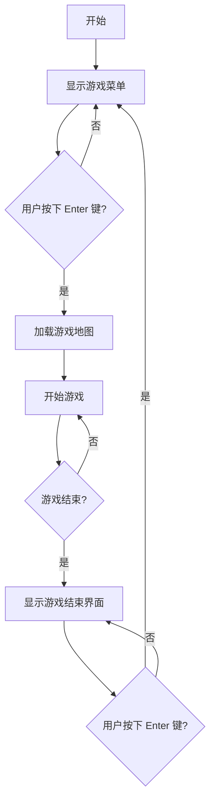
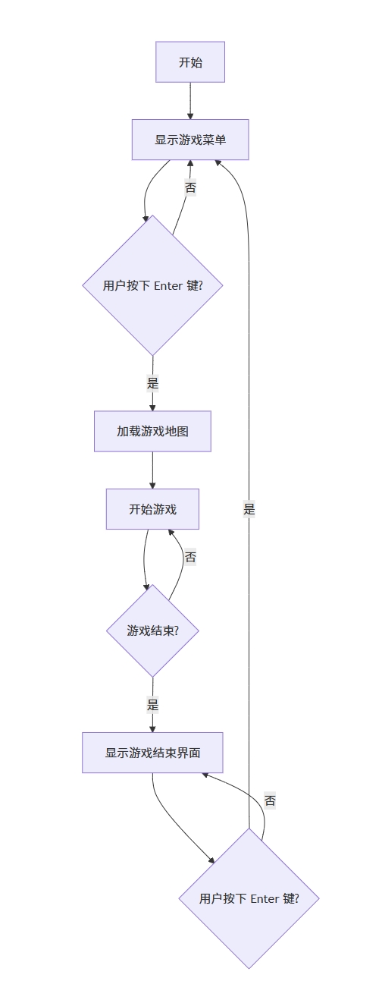
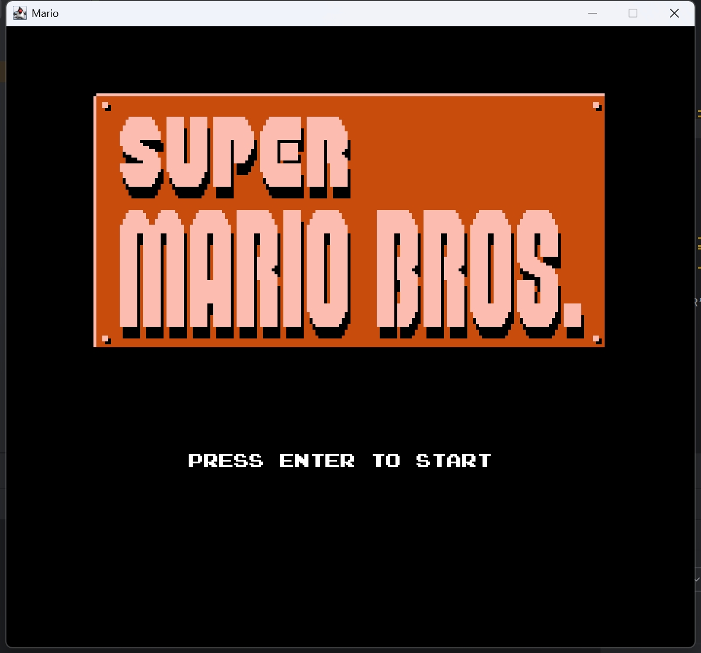
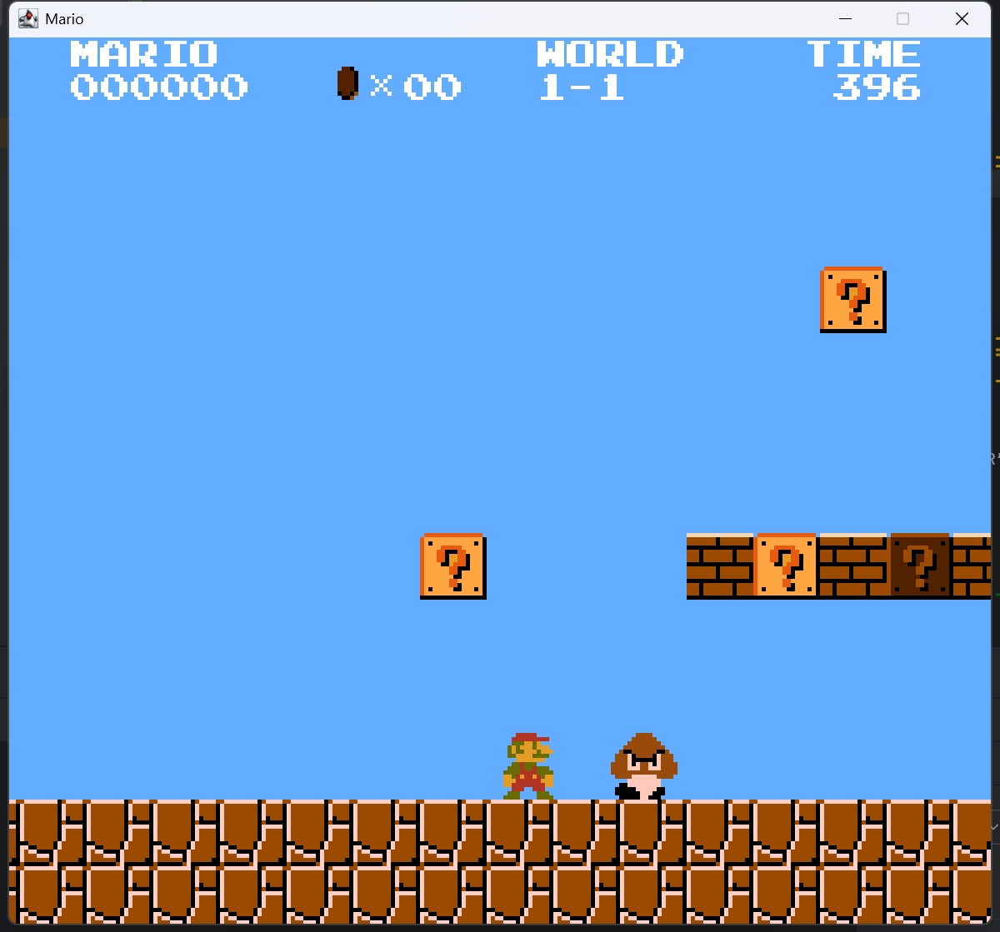
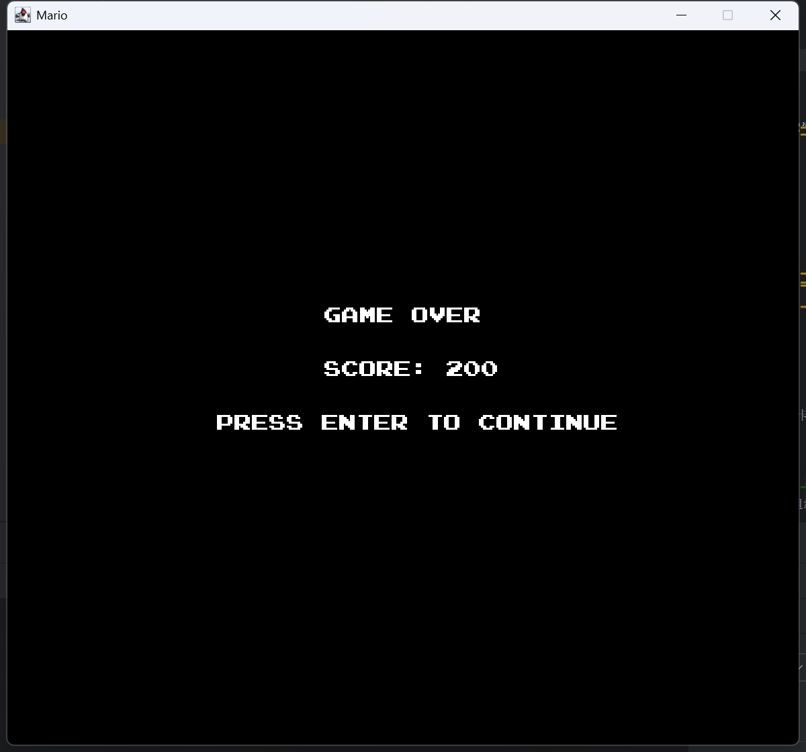

# 《超级马里奥游戏 Java 开发实验报告》

## 一、实验目的及要求

### 1.1 实验目的
本次实验旨在通过开发一个超级马里奥游戏，深入理解和掌握 Java 编程中的面向对象编程思想、图形用户界面（GUI）设计、多线程编程、事件处理机制以及资源管理等知识和技能。同时，锻炼代码的组织和架构能力，提高解决实际问题的能力和编程实践经验。

### 1.2 实验要求
- 使用 Java 语言进行开发，遵循面向对象编程原则，确保代码结构清晰、可维护性高。
- 设计并实现游戏的主要功能，包括游戏菜单、游戏主界面、游戏结束界面等，具备游戏开始、结束、重新开始等基本流程。
- 实现游戏中的基本元素，如玩家角色（马里奥）、地图、道具、敌人等，并处理它们之间的交互逻辑。
- 处理游戏中的碰撞检测、物理模拟（如重力、跳跃等），保证游戏的物理效果真实合理。
- 设计并实现游戏的音效系统，增强游戏的沉浸感。
- 对代码进行详细的注释，提高代码的可读性。

## 二、系统设计

### 2.1 系统总体框架（流程图）



### 2.2 系统详细设计（包括算法、代码及部分流程图）

#### 2.2.1 类设计
- **`UIManager` 类**：负责游戏界面的管理，包括窗口的创建、绘制和刷新，以及事件的监听和处理。
```java
package github.PanheadGG.SuperMarioBros.manager;

import github.PanheadGG.SuperMarioBros.core.scene.Drawable;
import github.PanheadGG.SuperMarioBros.timer.MicroTimer;

import javax.swing.*;
import java.awt.*;
import java.awt.event.*;
import java.awt.image.BufferStrategy;

public class UIManager extends JFrame implements Runnable {
    private Drawable draw;
    private BufferStrategy bufferStrategy;
    private int refreshRate;

    private boolean isDragging;
    private int xx, yy;

    public UIManager(Drawable draw, int width, int height, int refreshRate) {
        this.draw = draw;
        this.refreshRate = refreshRate;
        setSize(width, height);
        init();
    }

    public UIManager(int width, int height, int refreshRate) {
        this.refreshRate = refreshRate;
        setSize(width, height);
        init();
    }

    private void init() {
        setTitle("Mario");
        setDefaultCloseOperation(JFrame.EXIT_ON_CLOSE);
        enableInputMethods(false);
        setResizable(false);
        setVisible(true);
        createBufferStrategy(2);
        bufferStrategy = getBufferStrategy();
        setLocationRelativeTo(null);
        setForeground(Color.WHITE);

        // 实现无边框拖拽界面
        this.addMouseListener(new MouseAdapter() {
            public void mousePressed(MouseEvent e) {
                isDragging = true;
                xx = e.getX();
                yy = e.getY();
            }

            public void mouseReleased(MouseEvent e) {
                isDragging = false;
            }
        });

        this.addMouseMotionListener(new MouseMotionAdapter() {
            public void mouseDragged(MouseEvent e) {
                if (isDragging) {
                    int left = getLocation().x;
                    int top = getLocation().y;
                    setLocation(left + e.getX() - xx, top + e.getY() - yy);
                }
            }
        });
    }

    public void setRefreshRate(int refreshRate) {
        this.refreshRate = refreshRate;
    }

    @Override
    public void update(Graphics g) {
        paint(g);
    }

    @Override
    public void paint(Graphics g) {
        if (bufferStrategy == null) {
            createBufferStrategy(2);
            bufferStrategy = getBufferStrategy();
        }

        do {
            do {
                Graphics graphics = bufferStrategy.getDrawGraphics();
                try {
                    graphics.clearRect(0, 0, getWidth(), getHeight());
                    if (draw != null) {
                        draw.drawFrame(graphics);
                    } else {
                        setBackgroundColor(Color.BLACK);
                    }
                } finally {
                    graphics.dispose();
                }
            } while (bufferStrategy.contentsRestored());
            bufferStrategy.show();
        } while (bufferStrategy.contentsLost());
    }

    @Override
    public void run() {
        double fps = 0;
        long start = System.currentTimeMillis();
        long end;
        int frame = 0;
        while (true) {
            repaint();
            end = System.currentTimeMillis();
            frame++;
            if (frame >= refreshRate) {
                frame = 0;
                fps = refreshRate * 1000 / (double) (end - start);
                start = System.currentTimeMillis();
            }
            MicroTimer.sleep(1000000 / refreshRate);
        }
    }

    public void setBackgroundColor(Color color) {
        this.getContentPane().setBackground(color);
    }

    public void setDraw(Drawable draw) {
        this.draw = draw;
    }

    public void setKeyListener(KeyListener keyListener) {
        KeyListener[] keyListeners = this.getKeyListeners();
        for (KeyListener keyListener1 : keyListeners) {
            this.removeKeyListener(keyListener1);
        }
        this.addKeyListener(keyListener);
    }
}
```
- **`GameEngine` 类**：游戏的核心引擎，负责游戏的逻辑更新、地图加载、碰撞检测等操作。
```java
package github.PanheadGG.SuperMarioBros.core.scene;

import github.PanheadGG.SuperMarioBros.assets.Assets;
import github.PanheadGG.SuperMarioBros.assets.DynamicImage;
import github.PanheadGG.SuperMarioBros.callback.GameOverCallback;
import github.PanheadGG.SuperMarioBros.manager.UIManager;
import github.PanheadGG.SuperMarioBros.manager.SoundManager;
import github.PanheadGG.SuperMarioBros.map.GameMap;
import github.PanheadGG.SuperMarioBros.map.MapLoader;
import github.PanheadGG.SuperMarioBros.timer.MicroTimer;

import java.awt.*;
import java.awt.event.ComponentEvent;
import java.awt.event.KeyListener;
import java.awt.image.BufferedImage;

public class GameEngine implements Runnable, Drawable {
    private int gameTickRate = 200;
    private int refreshRate = 165;
    private int pixelPerUnit = 80;
    private int tickOfGameTickRate = 0;
    private int mapWidth;
    private int mapHeight;
    private GameMap map;
    private int score = 0;
    private int coinCount = 0;
    private int time = 400;
    private int currentTick = 0;
    private DynamicImage scoreCoin;
    private BufferedImage plusImage;

    private UIManager ui = null;

    private KeyListener keyListener;
    private Color backgroundColor = new Color(0, 0, 0, 255);
    private String gameState = GameState.LOADING_MAP;
    private int starManTime = 0;

    private int timeout = 0;

    private GameOverCallback gameOverCallback;

    private boolean runnable = true;

    public static class GameState {
        public static String GAME_OVER = "GAME_OVER";
        public static String GAME_WIN = "GAME_WIN";
        public static String GAME_RUNNING = "GAME_RUNNING";
        public static String GAME_DYING = "GAME_DYING";
        public static String GAME_TIME_OUT = "GAME_TIME_OUT";
        public static String MARIO_LEVEL_UP = "MARIO_LEVEL_UP";
        public static String LOADING_MAP = "LOADING_MAP";
    }

    public GameEngine() {
        scoreCoin = Assets.getDynamicImageByKey("texture.item.score_coin");
        scoreCoin.setGameTickRate(gameTickRate);
        plusImage = Assets.getImageByKey("texture.item.plus");
    }

    public void setUI(UIManager ui) {
        this.ui = ui;
    }

    public UIManager getUI() {
        return ui;
    }

    public void loadMap() {
        MapLoader loader = new MapLoader();
        loader.setGroundMap(this);
        loader.load(GameEngine.class.getResource("/assets/map/level_1.json"));
        map = loader.getGroundMap();
        mapWidth = map.getMapWidth();
        mapHeight = map.getMapHeight();
        pixelPerUnit = map.getPixelPerUnit();
        backgroundColor = loader.getBackgroundColor();
        keyListener = map.getKeyListener();
        time = loader.getTime();
        timeout = 100;
    }

    public Color getBackgroundColor() {
        return backgroundColor;
    }

    public void setBackgroundColor(Color backgroundColor) {
        this.backgroundColor = backgroundColor;
    }

    public void setKeyListener(KeyListener keyListener) {
        this.keyListener = keyListener;
    }

    public KeyListener getKeyListener() {
        return keyListener;
    }

    public void setStarManTime(int starManTime) {
        this.starManTime = starManTime;
    }

    public int getStarManTime() {
        return starManTime;
    }

    @Override
    public void drawFrame(Graphics g) {
        if (gameState.equals(GameState.GAME_RUNNING) || gameState.equals(GameState.GAME_WIN) || gameState.equals(GameState.GAME_DYING) || gameState.equals(GameState.MARIO_LEVEL_UP) || gameState.equals(GameState.GAME_TIME_OUT)) {
            map.drawFrame(g);
        } else if (gameState.equals(GameState.LOADING_MAP)) {

        }
        g.setFont(Assets.getFont(35f));
        g.drawString("MARIO", pixelPerUnit, pixelPerUnit);
        g.drawString(String.format("%06d", score), pixelPerUnit, (int) (1.5 * pixelPerUnit));

        if (scoreCoin != null && plusImage != null) {
            g.drawImage(scoreCoin.getTexture(), (int) (pixelPerUnit * 5), pixelPerUnit, pixelPerUnit / 2, pixelPerUnit / 2, null);
            g.drawImage(plusImage, (int) (pixelPerUnit * 5.5), pixelPerUnit, pixelPerUnit / 2, pixelPerUnit / 2, null);
        }
        g.drawString(String.format("%02d", coinCount), (int) (6 * pixelPerUnit), (int) (1.5 * pixelPerUnit));
        g.drawString("WORLD", pixelPerUnit * 8, pixelPerUnit);
        g.drawString(map.getMapName(), pixelPerUnit * 8, (int) (1.5 * pixelPerUnit));

        g.drawString("TIME", pixelPerUnit * 12, pixelPerUnit);
        g.drawString(String.format("%4d", time), pixelPerUnit * 12, (int) (1.5 * pixelPerUnit));
    }

    @Override
    public void run() {
        double tps = 0;
        long start = System.currentTimeMillis();
        long end;
        int tick = 0;
        while (runnable) {
            tick++;
            end = System.currentTimeMillis();
            if (tick >= gameTickRate) {
                tick = 0;
                tps = gameTickRate * 1000 / (double) (end - start);
                start = System.currentTimeMillis();
            }
            update();
            if (map != null) map.update();
            MicroTimer.sleep(1000000 / gameTickRate);
        }
    }

    public void update() {
        scoreCoin.update();
        if (timeout > 0) {
            timeout--;
        }

        if (gameState.equals(GameState.LOADING_MAP) && timeout == 0) {
            ui.setBackground(backgroundColor);
            gameState = GameState.GAME_RUNNING;
            SoundManager.playBackground(SoundManager.BackgroundMusic.MAIN);
            timeout = -1;
        } else if (gameState.equals(GameState.GAME_DYING) && timeout == 0) {
            gameState = GameState.GAME_OVER;
            runnable = false;
            gameOverCallback.onGameOver(GameOverUI.Reason.GAME_OVER, score);
        } else if (gameState.equals(GameState.GAME_TIME_OUT) && timeout == 0) {
            runnable = false;
            gameOverCallback.onGameOver(GameOverUI.Reason.TIME_OUT, score);
        }

        if (gameState.equals(GameState.GAME_RUNNING)) {
            currentTick++;
            currentTick = currentTick % gameTickRate;
            if (currentTick == 0) {
                if (starManTime > 0) starManTime--;
                if (starManTime == 2 && time > 100)
                    SoundManager.playBackground(SoundManager.BackgroundMusic.MAIN);
                else if (starManTime == 2)
                    SoundManager.playBackground(SoundManager.BackgroundMusic.SPEED_UP);
                time--;
                if (time == 100)
                    SoundManager.playBackground(SoundManager.BackgroundMusic.SPEED_UP);
            }
            if (time <= 0) {
                gameState = GameState.GAME_TIME_OUT;
                SoundManager.playBackground(SoundManager.BackgroundMusic.STOP);
                SoundManager.playOutOfTime();
                timeout = 4 * gameTickRate;
            }
        } else if (gameState.equals(GameState.LOADING_MAP)) {
            if (ui != null) {
                ui.setBackground(new Color(0, 0, 0, 255));
            }
        } else if (gameState.equals(GameState.GAME_WIN)) {
            while (time-- > 0) {
                addScore(50);
                MicroTimer.sleep(20_000);
            }
            SoundManager.stopCountDown();
            runnable = false;
            gameOverCallback.onGameOver(GameOverUI.Reason.WIN, score);

            System.gc();
        }
    }

    public int getGameTickRate() {
        return gameTickRate;
    }

    public int getPixelPerUnit() {
        return pixelPerUnit;
    }

    public void onWindowSizeChanged(ComponentEvent e) {

    }

    public void addScore(int score) {
        this.score += score;
    }

    public int getScore() {
        return score;
    }

    public void addCoinCount(int coinCount) {
        this.coinCount += coinCount;
    }

    public int getCoinCount() {
        return coinCount;
    }

    public String getGameState() {
        return gameState;
    }

    public void setGameState(String gameState) {
        this.gameState = gameState;
    }

    public void setTimeout(int timeout) {
        this.timeout = timeout * gameTickRate;
    }

    public void setGameOverCallback(GameOverCallback gameOverCallback) {
        this.gameOverCallback = gameOverCallback;
    }
}
```

#### 2.2.2 算法设计
- **碰撞检测算法**：通过比较游戏对象的矩形区域是否相交来判断是否发生碰撞。
```java
// 在 GameObject 类中实现碰撞检测方法
public boolean isColliding(GameObject other) {
    Rectangle thisRect = this.getRectangle();
    Rectangle otherRect = other.getRectangle();
    return thisRect.intersects(otherRect);
}
```
- **物理模拟算法**：使用加速度和速度来模拟物体的运动，例如在 `GameObject` 类中更新物体的位置和速度。
```java
public void updatePosition() {
    updateVelocity();
    x += velX / gameTickRate;
    y += velY / gameTickRate;
}

public void updateVelocity() {
    updateVelX();
    updateVelY();
}

public void updateVelX() {
    velX += horizontalAcc / gameTickRate;
    if (limitVelX == 0) return;
    if (velX > limitVelX) velX = limitVelX;
    if (velX < -limitVelX) velX = -limitVelX;
}

public void updateVelY() {
    velY += verticalAcc / gameTickRate;
    if (limitVelY == 0) return;
    if (velY > limitVelY) velY = limitVelY;
    if (velY < -limitVelY) velY = -limitVelY;
}
```

## 三、实验结果（测试）

### 3.1 游戏菜单界面
- 启动游戏后，成功显示游戏菜单界面，菜单背景为黑色，显示游戏 logo 和“Press Enter to start”提示信息。

- 按下 Enter 键，游戏进入加载地图阶段，菜单界面切换为加载界面。

### 3.2 游戏主界面
- 地图加载完成后，显示游戏主界面，包含地图、玩家角色（马里奥）、道具和敌人等元素。
- 玩家可以通过键盘控制马里奥的移动（左右移动、跳跃），移动和跳跃动作流畅。
- 马里奥与道具发生碰撞时，道具消失，分数增加，同时播放音效。
- 当时间减少到 100 时，背景音乐切换为加速音乐，增加游戏紧张感。


### 3.3 游戏结束界面
- 当马里奥死亡或时间耗尽时，游戏结束，显示游戏结束界面，根据不同的结束原因显示相应的提示信息（如“GAME OVER”、“TIME OUT”）和最终得分。
- 按下 Enter 键，游戏返回菜单界面，可重新开始游戏。


## 四、实验总结分析

### 4.1 已实现功能
- 游戏菜单界面：显示游戏 logo 和开始提示，支持通过 Enter 键开始游戏。
- 游戏主界面：加载地图，显示玩家角色、道具和敌人，支持玩家控制角色移动和跳跃，处理碰撞检测和物理模拟。
- 游戏结束界面：根据不同的结束原因显示相应的提示信息和最终得分，支持通过 Enter 键重新开始游戏。
- 音效系统：实现游戏背景音乐和各种音效（如金币音效、跳跃音效等）的播放和切换。

### 4.2 未实现功能
- 敌人的 AI 行为：目前敌人的行为比较简单，没有实现复杂的 AI 逻辑，如追逐玩家、躲避障碍物等。
- 更多的道具和关卡：游戏中仅实现了部分道具（如金币、超级蘑菇、火蘑菇、无敌星星），可以增加更多种类的道具和关卡，丰富游戏内容。
- 网络对战功能：未实现多人网络对战功能，无法让多个玩家同时在线对战。

### 4.3 心得体会
通过本次实验，我对 Java 编程有了更深入的理解和掌握。在开发过程中，我学会了如何运用面向对象编程思想来设计和组织代码，将游戏中的各个元素抽象成不同的类，提高了代码的可维护性和可扩展性。同时，我也掌握了 Java 的图形用户界面设计、多线程编程、事件处理机制和资源管理等知识和技能，这些知识和技能将对我今后的编程学习和工作有很大的帮助。

在实验过程中，我也遇到了一些问题和挑战，例如碰撞检测的精度问题、物理模拟的效果优化等。通过查阅资料、参考相关代码和不断尝试，我最终解决了这些问题。这让我深刻体会到编程是一个不断学习和实践的过程，只有不断地解决问题，才能提高自己的编程能力。